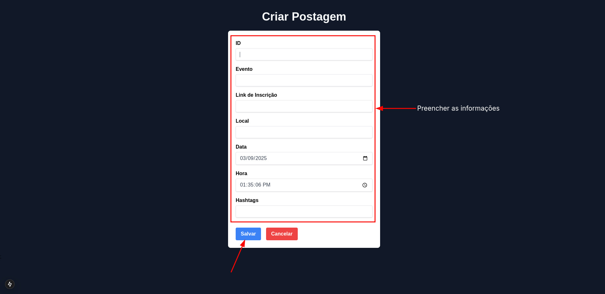

## Construtor de Posts

## O que é este projeto?

Este projeto é uma ferramenta para ajudar na geração de conteúdo para redes sociais, pensada especificamente para atender as necessidades do [GDG Pelotas](https://www.instagram.com/gdgpelotas/) e dos eventos da comunidade. O objetivo da ferramenta é permitir a criação da descrição das imagens de uma forma mais rápida do que utilizando ferramentas como o Figma, focando especificamente nas necessidades da comunidade.

## Como rodar esse projeto?

Para executar o projeto, você precisa fazer o download do repositório e rodar o comando `npm i` na pasta raiz do projeto. Depois disso, basta rodar o comando `npm run dev` e você já terá o projeto rodando. A aplicação também pode ser acessa através do site [clicando aqui](post.lelepg.app)

## Como usar esse projeto?

### 1. Criar um evento

A primeira coisa que deve ser feita na aplicação é a criação de um evento, uma vez que os posts serão gerados considerando um evento. Para criar um evento, você pode clicar no botão `Gerenciar Eventos` da página inicial. Isso te levará para a página onde os eventos são listados, e aqui você pode criar um novo evento clicando em `Novo Evento`.

Isso abrirá o formulário de cadastro de evento e você deve então adicionar as informações referentes ao evento e clicar em salvar. Ao cadastrar um evento, será pedido um id do evento. Você pode utilizar qualquer valor como id, mas é importante salientar que esse id será utilizado para pegar as informações do evento nas lógicas internas da aplicação.

Depois de salvo, você pode editar o evento ou excluí-lo através da página de gerenciamento de eventos.

**Importante**: Os eventos cadastrados estão ficando salvos no localStorage do navegador, então modificar o localStorage pode ter impacto nos seus eventos.

### 2. Criar descrição

Uma vez que o evento tenha sido salvo e apareça na página de gerenciamento de eventos, você pode criar as descrições de posts na sessão **Descrição da Postagem**. Aqui, o que você precisa fazer é selecionar o evento no primeiro select e o tipo de post que quer criar no segundo.

Alguns tipos de posts irão requerer parâmetros extras, e nesses casos novos inputs aparecerão para que você preencha esses parâmetros. Após preencher os parâmetros, você pode clicar em `Gerar Post`. Isso fará com que a descrição do post apareça na caixa de texto.

Os posts cadastrados seguem um modelo pré-definido referente ao tipo de post. Para alterar o modelo, é preciso alterar o código, mas você pode gerar um post de um determinado modelo e alterá-lo alterando o texto digitado na caixa para que ele atenda melhor às suas necessidades. Depois de satisfeito com o texto, basta clicar no botão de copiar para copiar todo o texto para o clipboard da sua máquina.

### 3. Gerar Imagem

Para gerar a imagem, o primeiro passo é fazer o upload de um modelo de postagem na sessão **Imagem da Postagem**. O editor da imagem da aplicação tem como objetivo colocar textos em cima de uma imagem, então é recomendado que você crie uma imagem base para as suas postagens em outra ferramenta e a utilize aqui.

Depois de fazer o upload da imagem na aplicação, você verá um menu lateral com as opções `Adicionar Texto`, `Salvar Imagem` e `Salvar como SVG`. Essas opções são responsáveis por permitir que novos textos sejam adicionados na aplicação, que a imagem seja salva em formato svg e que a imagem seja salva em formato png.

Ao clicar em adicionar texto, uma caixinha de texto com uma borda vermelha aparecerá na imagem. Para editar o texto da caixa, você pode interagir com o menu lateral, onde tem as opções de digitar o texto que deve ser apresentado, bem como definir configurações como cor do texto, negrito, itálico, tamanho da fonte, onde o texto será justificado e, é claro, a fonte a ser usada.

Depois de configurar o texto, você pode movê-lo pela imagem arrastando a caixa onde o texto aparece. Você também pode redimensionar o tamanho da caixa onde o texto é exibido clicando no lado direito da caixa onde fica uma borda rosa. Depois de colocar seu texto no lugar correto, clique fora da caixa com a borda vermelha para sair da edição do texto.

Caso você queira adicionar mais textos, sinta-se à vontade. Para isso, basta clicar novamente no botão `Adicionar Texto`.

Uma vez que você esteja satisfeita com a imagem, garanta que nenhum texto está selecionado e salve a imagem usando o botão `Salvar Imagem` ou `Salvar como SVG`.

